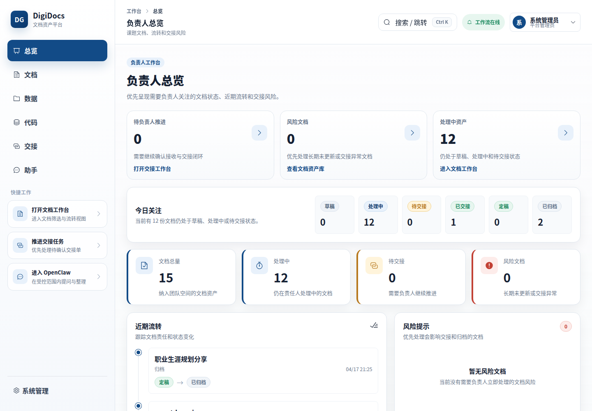
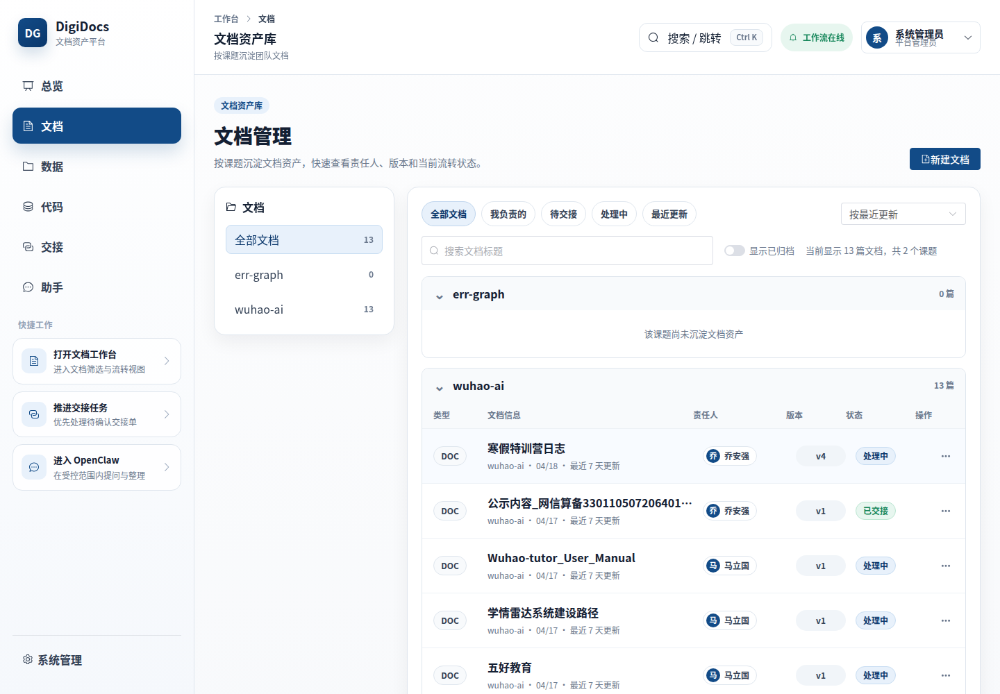
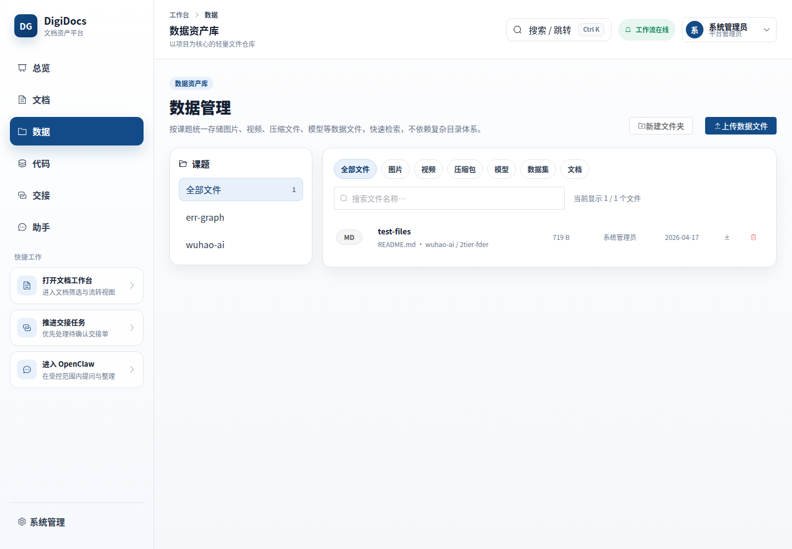
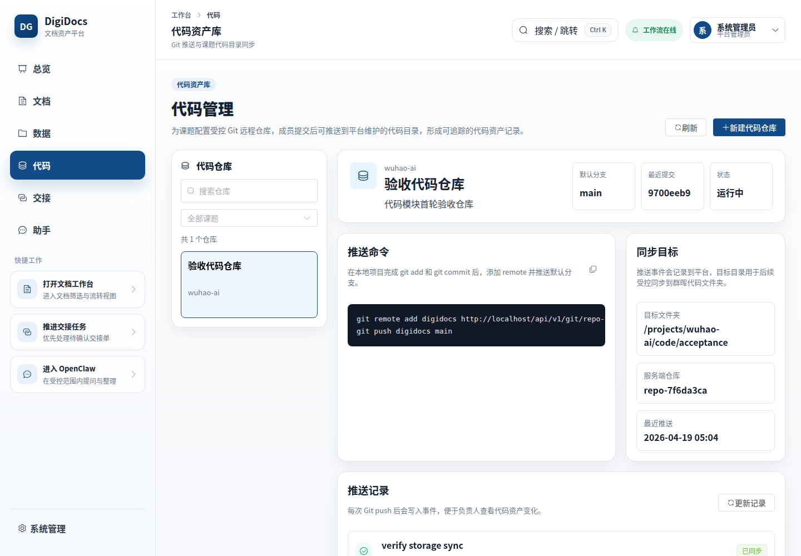
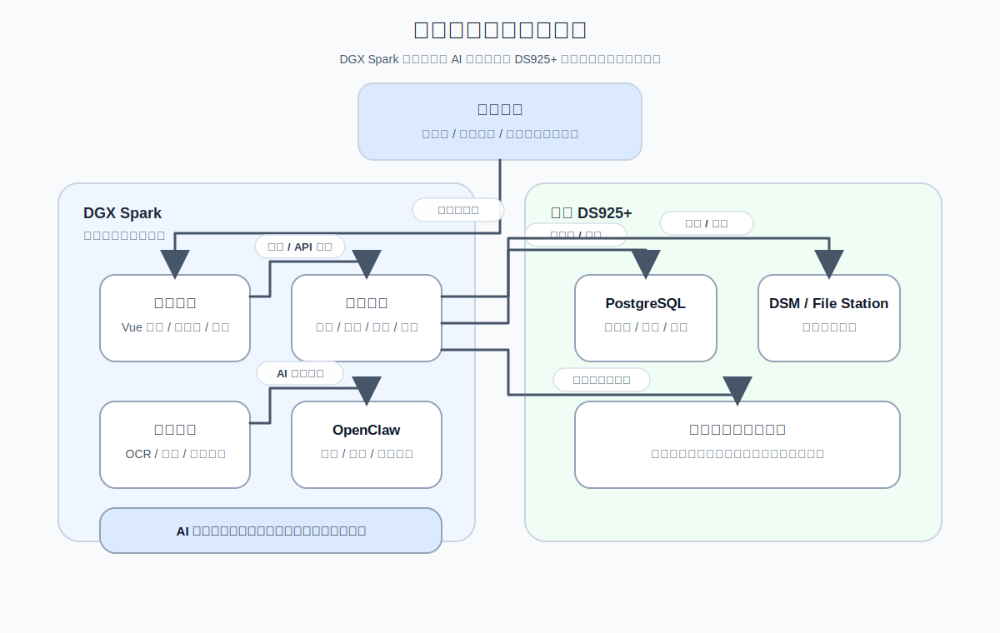

# DigiDocs Mgt 产品介绍与部署清单

面向对象：课题组负责人 /  团队管理者

更新时间：2026-04-19

## 1. 产品定位

`DigiDocs Mgt` 是一套面向课题组日常管理的文档、数据、代码资产管理与智能助理系统。

由 `DigiDocs Mgt` 负责文档资产、流程和管理闭环;
由部署在 `DGX Spark` 上的 `OpenClaw` 提供智能理解与辅助能力。
两者结合后，解决的不只是“文档存下来”，而是“文档存下来以后，负责人和团队能不能更高效地使用”。

由此获得的核心收益：

- 文档、数据和代码掌握在团队手里，而不是散落在个人电脑里；
- 现在这份材料到底由谁负责、推进到哪一步；
- 临近中期检查、结题、毕业交接时，负责人能不能快速看清风险；
- 团队历史材料能不能真正被复用，而不是每次都从头再找、再问、再整理。
- 面对成堆历史材料时，负责人能不能不用逐份翻文件，也能快速获得摘要、线索、风险判断和可追问的解释。

## 2. 产品功能

`DigiDocs Mgt` 围绕课题组最常见的文档、数据和代码对象工作，包括 `docx / xlsx / pptx / pdf` 等材料、图片/视频/压缩包/模型文件、以及可通过 Git 推送沉淀的代码工程，提供以下能力：

- 以“团队空间 -> 课题/项目 -> 子目录”的固定结构沉淀文档；
- 以“文件级版本”管理每次提交，不再靠文件名后缀区分 `最终版 / 最终版2 / 真最终版`；
- 以“显式流转”管理责任人变化，知道一份材料现在卡在谁手里；
- 以“数据资产库”管理图片、视频、压缩包、模型、数据集等非 Office/PDF 文件；
- 以“代码资产库”提供受控 Git remote，让成员本地 `git add`、`git commit` 后直接 `git push` 到平台维护的课题代码目录；
- 以“毕业交接”形成标准流程，避免成员离组后资料断档；
- 以“负责人总览”看到各课题当前进度、风险点和长期未处理文档；
- 以 `OpenClaw` 为智能助理，对已有材料提供摘要、问答、归类建议、交接梳理和风险提示。

### 2.1 系统界面实拍

> 下图为当前系统真实截图，可以快速感知产品界面风格、信息组织方式与管理视角。

<table>
  <tr>
    <td width="50%" align="center">
      
       
      图 1：负责人总览 - 文档状态、风险和近期流转
    </td>
    <td width="50%" align="center">
      
       
      图 2：文档资产库 - 按课题查看文档和责任状态
    </td>
  </tr>
  <tr>
    <td width="50%" align="center">
      
       
      图 3：数据资产库 - 管理图片、模型、压缩包和数据集
    </td>
    <td width="50%" align="center">
      
       
      图 4：代码资产库 - Git 推送、目标目录和同步记录
    </td>
  </tr>
</table>

## 3. 应用场景

### 3.1 课题启动阶段

负责人最常见的问题：

- 新课题开始后，材料散落在微信、邮箱、U 盘、个人电脑等各处；
- 团队成员知道“自己在写什么”，但负责人并不知道“整个课题资料体系现在是什么状态”；
- 后续新成员加入时，不知道从哪里入手。

`DigiDocs Mgt` 的作用：

- 为每个课题建立固定的资料挂接位置；
- 所有材料都落到团队空间和课题名下，不再依赖某个人的本地目录；
- 数据文件和代码工程也能绑定到同一课题，避免文档、数据、代码分散沉淀；
- 负责人从第一天就能按课题维度查看文档总量、状态分布、数据资产和代码仓库。
- `OpenClaw` 可以基于已有目录和历史材料形成课题资料概览，帮助负责人更快判断“现有材料是否足以支撑下一步工作”。

### 3.2 日常撰写与协作阶段

负责人最困扰的通常不是“大家没在写”，而是“不知道哪一版才是真的、谁在改、改到哪了”。

常见场景：

- 申报书、阶段总结、论文附件、会议材料反复修改；
- 成员把文件发来发去，文件名越来越长，但没人能保证版本关系；
- 负责人想看最新稿，却经常拿到旧版；
- 一个成员改完交给另一个成员，交接过程只留在聊天记录里。

`DigiDocs Mgt` 的作用：

- 每次提交新稿，系统自动形成新版本；
- 每个版本可写明本次修改说明；
- 文档可以显式转交给下一责任人，而不是靠口头说“你继续跟”；
- 负责人看到的是“当前版本 + 当前责任人 + 最近流转记录”，而不是一堆零散附件。
- 大文件、数据集和模型文件可进入数据资产库，不再混在文档列表中；
- 代码工程可通过 Git remote 推送到平台维护的课题代码目录，push 事件可追踪。
- 在版本不断增加后，`OpenClaw` 可以帮助提炼内容重点和修改变化，让负责人不必每次都从头通读整份材料。

### 3.3 周会、月报、中期检查前

负责人真正需要的是“快速掌握风险”，而不是逐个打开文件夹排查。

常见问题：

- 哪些文档很久没人更新；
- 哪些材料一直停在草稿或处理中；
- 哪些课题资料分布不完整；
- 哪些交接动作还没确认；
- 哪些重要材料下载频繁、流转频繁，需要重点盯一下。
- 哪些课题已有数据文件、代码仓库，最近是否有新的 push 或同步记录。

`DigiDocs Mgt` 的作用：

- 提供负责人总览页，直接看到各课题文档数量、状态分布和近期动态；
- 自动标出长期未更新、长期无人接手、待交接未完成等风险项；
- 数据资产库和代码资产库让负责人能区分“文档材料”“实验数据”“工程代码”三类资产；
- 把审计留痕变成管理信息，而不是一堆难读的日志。
- `OpenClaw` 可以把这些动态整理成更容易阅读的管理摘要，例如“本周哪个课题推进最慢、哪些材料存在断点、哪些文档值得优先关注”。

### 3.4 成员毕业、离组、换题时

这是很多课题组真正最痛的一步。

常见问题：

- 负责人知道某位成员“做过很多事”，但并不知道具体哪些资料还在他手上；
- 接收人不知道应接收哪些文档、哪些版本、哪些上下文说明；
- 交接过程缺少清单，后续追责和补找非常困难。

`DigiDocs Mgt` 的作用：

- 负责人可以按成员、课题、目录归集交接范围；
- 系统生成交接清单，明确哪些文档需要交、由谁接；
- 数据资产可纳入交接清单，代码仓库也具备后续纳入交接范围的基础账本；
- 交接动作可确认、可追踪、可复盘；
- AI 可生成交接摘要，帮助负责人快速理解“这个人留下了什么、还缺什么、风险是什么”。
- 这里的智能能力由 `OpenClaw` 提供，它不只是生成一段摘要，而是帮助负责人把“资料清单、上下文关系和待办风险”一起看清楚。

### 3.5 结题、复盘、下一轮申报时

困扰团队的不是“材料不存在”，而是“明明做过，却找不到、看不懂、用不上”。

`DigiDocs Mgt` 的作用：

- 历史材料按课题、目录、版本和责任关系保留下来；
- 历史数据按课题和文件夹保留下来，代码工程按仓库和 push 事件保留下来；
- 可对已有材料做摘要、问答和结构化检索；
- 负责人在下一次申报、复盘、审计或对外汇报时，能更快调出历史依据。
- `OpenClaw` 在这一阶段的价值尤其明显：它可以把“存下来的历史材料”转化成“可以追问、可以解释、可以复用的团队知识”。

## 4. 核心价值

### 4.1 对团队的价值

- 减少重复找文件、问版本、问责任人的沟通成本；
- 新成员更快接手历史材料；
- 文档、数据和代码不再跟着个人走，团队资产沉淀更稳；
- 文档处理和 `OpenClaw` 的智能辅助都围绕统一材料底座进行，避免出现“回答听起来不错，但和真实资料脱节”的情况。

### 4.2 对负责人的价值

- 看到的是“课题推进状态”，而不是单点文件；
- 在关键节点前，可以更早发现断点和风险；
- 毕业交接从“人情提醒”变成“有清单、有确认、有记录”的正式动作；
- 团队知识资产可以连续积累，而不是随人员流动周期性清零。
- `OpenClaw` 让负责人不只是“看见文件”，而是能更快“理解文件、追问文件、用好文件”。

## 5. 系统的工作方式

`DigiDocs Mgt` 采用的是适合课题组的轻量协作方式，不要求在线共编，也不要求成员改变原有 Office 使用习惯。

核心机制有六个：

1. 文档必须挂到团队空间、课题和目录中；
2. 每次上传形成文件级新版本；
3. 责任变更通过显式流转完成；
4. 数据资产独立进入数据资产库，按课题、文件夹和文件类型管理；
5. 代码资产通过平台生成的 Git remote 接收 push，并同步到课题代码目录；
6. 关键动作留下审计记录，AI 结果始终作为“建议”存在，不直接改正式状态。

这意味着：

- 团队仍然可以继续使用熟悉的 Word / Excel / PPT；
- 成员仍然可以继续使用熟悉的 Git 工作流；
- 负责人得到的是更强的管理可见性；
- `OpenClaw` 是辅助能力，不会绕开管理流程直接改正式状态；
- 团队获得的是“可管理的文档系统 + 可解释的智能助手”，而不是彼此割裂的两个工具。

## 6. 推荐部署方案

### 6.1 系统总体架构

下图展示 `DigiDocs Mgt`、`DGX Spark`、`OpenClaw` 与 `群晖 DS925+` 的协同方式。整体思路是“DGX Spark 负责应用与智能处理，群晖负责文件与数据库底座”，这样既便于后续运维，也能保持 AI 能力与正式业务状态的边界清晰。

  

  图 5：DigiDocs Mgt + DGX Spark + 群晖 DS925+ 系统总体架构

可以概括为三个要点：

1. `DGX Spark` 负责承载系统前后端、异步任务和 `OpenClaw` 智能能力；
2. `群晖 DS925+` 负责承载文件资产与数据库主账本；
3. `OpenClaw` 提供摘要、问答、建议等辅助能力，不直接改正式业务状态。

### 6.2 推荐硬件组合

建议继续采用“两台正式部署机器”的方案：

- `NVIDIA DGX Spark`
  - 承载应用层、Python Worker、`OpenClaw` 以及相关智能处理任务；
- `群晖 DS925+`
  - 承载文件存储、数据库与团队资料底座。

这样做的收益是：

- 结构清晰，便于后续维护；
- AI 计算和存储职责分开；
- `OpenClaw` 与业务平台协同运行，但不直接改正式业务状态，边界清晰；
- 负责人更容易理解“哪台机器负责算、哪台机器负责存”；
- 业务元数据与文件资产分层放置，便于后续扩容、备份与审计；
- 现场扩容时也更容易分步升级。

## 7. 基础硬件与网络清单

如下是适合课题组正式部署的基础清单。分为“必需项”和“选配项”。

### 7.1 必需项

<table style="width: 100%; border-collapse: collapse;">
  <thead>
    <tr>
      <th style="border: 1px solid #d1d5db; padding: 8px;">类别</th>
      <th style="border: 1px solid #d1d5db; padding: 8px;">设备</th>
      <th style="border: 1px solid #d1d5db; padding: 8px;">建议数量</th>
      <th style="border: 1px solid #d1d5db; padding: 8px;">作用</th>
      <th style="border: 1px solid #d1d5db; padding: 8px;">公开报价</th>
    </tr>
  </thead>
  <tbody>
    <tr>
      <td style="border: 1px solid #d1d5db; padding: 8px;">计算主机</td>
      <td style="border: 1px solid #d1d5db; padding: 8px;">NVIDIA DGX Spark 4TB</td>
      <td style="border: 1px solid #d1d5db; padding: 8px;">1</td>
      <td style="border: 1px solid #d1d5db; padding: 8px;">承载应用服务、Worker、AI 处理</td>
      <td style="border: 1px solid #d1d5db; padding: 8px;"><code>$4,699.00</code>，约 <code>¥32,261</code></td>
    </tr>
    <tr>
      <td style="border: 1px solid #d1d5db; padding: 8px;">存储主机</td>
      <td style="border: 1px solid #d1d5db; padding: 8px;">群晖 DS925+</td>
      <td style="border: 1px solid #d1d5db; padding: 8px;">1</td>
      <td style="border: 1px solid #d1d5db; padding: 8px;">承载团队文件底座与数据库</td>
      <td style="border: 1px solid #d1d5db; padding: 8px;"><code>¥4,999</code> 起</td>
    </tr>
    <tr>
      <td style="border: 1px solid #d1d5db; padding: 8px;">存储推荐组合</td>
      <td style="border: 1px solid #d1d5db; padding: 8px;">群晖 DS925+ 32TB 套装（4 x 8TB 原厂盘）</td>
      <td style="border: 1px solid #d1d5db; padding: 8px;">1</td>
      <td style="border: 1px solid #d1d5db; padding: 8px;">直接满足正式落地，不再单独拆盘采购</td>
      <td style="border: 1px solid #d1d5db; padding: 8px;"><code>¥11,939</code></td>
    </tr>
    <tr>
      <td style="border: 1px solid #d1d5db; padding: 8px;">内网交换</td>
      <td style="border: 1px solid #d1d5db; padding: 8px;">Ubiquiti Flex 2.5G PoE（USW-Flex-2.5G-8-PoE）</td>
      <td style="border: 1px solid #d1d5db; padding: 8px;">1</td>
      <td style="border: 1px solid #d1d5db; padding: 8px;">连接 DGX Spark、DS925+ 与办公网络，提供 2.5GbE 接入与 10GbE 组合上行口</td>
      <td style="border: 1px solid #d1d5db; padding: 8px;"><code>¥1,999</code></td>
    </tr>
    <tr>
      <td style="border: 1px solid #d1d5db; padding: 8px;">网线</td>
      <td style="border: 1px solid #d1d5db; padding: 8px;">Ubiquiti Premium Patch Cable（10GbE）</td>
      <td style="border: 1px solid #d1d5db; padding: 8px;">3</td>
      <td style="border: 1px solid #d1d5db; padding: 8px;">设备间短距连接</td>
      <td style="border: 1px solid #d1d5db; padding: 8px;"><code>¥49 / 根</code></td>
    </tr>
  </tbody>
</table>

说明：

- 32TB 是原始容量，正式可用容量取决于 RAID / SHR 策略；
- 对课题组场景，`DGX Spark + DS925+ 32TB 套装 + 2.5G/10G 交换` 已足以形成一套可正式运行的最小闭环。

### 7.2 选配项

<table style="width: 100%; border-collapse: collapse;">
  <thead>
    <tr>
      <th style="border: 1px solid #d1d5db; padding: 8px;">类别</th>
      <th style="border: 1px solid #d1d5db; padding: 8px;">设备</th>
      <th style="border: 1px solid #d1d5db; padding: 8px;">建议数量</th>
      <th style="border: 1px solid #d1d5db; padding: 8px;">适用场景</th>
      <th style="border: 1px solid #d1d5db; padding: 8px;">公开报价</th>
    </tr>
  </thead>
  <tbody>
    <tr>
      <td style="border: 1px solid #d1d5db; padding: 8px;">独立网关</td>
      <td style="border: 1px solid #d1d5db; padding: 8px;">Ubiquiti Cloud Gateway Fiber</td>
      <td style="border: 1px solid #d1d5db; padding: 8px;">1</td>
      <td style="border: 1px solid #d1d5db; padding: 8px;">现场希望把本系统与办公网逻辑隔离，单独做出口与策略管理</td>
      <td style="border: 1px solid #d1d5db; padding: 8px;"><code>¥2,799</code></td>
    </tr>
    <tr>
      <td style="border: 1px solid #d1d5db; padding: 8px;">无线覆盖</td>
      <td style="border: 1px solid #d1d5db; padding: 8px;">Ubiquiti U7 Lite</td>
      <td style="border: 1px solid #d1d5db; padding: 8px;">1</td>
      <td style="border: 1px solid #d1d5db; padding: 8px;">需要在机房/办公室为运维笔记本或移动终端提供独立无线接入</td>
      <td style="border: 1px solid #d1d5db; padding: 8px;"><code>¥999</code></td>
    </tr>
    <tr>
      <td style="border: 1px solid #d1d5db; padding: 8px;">供电保护</td>
      <td style="border: 1px solid #d1d5db; padding: 8px;">UPS</td>
      <td style="border: 1px solid #d1d5db; padding: 8px;">1</td>
      <td style="border: 1px solid #d1d5db; padding: 8px;">建议给 DGX Spark、DS925+、交换机提供断电保护</td>
      <td style="border: 1px solid #d1d5db; padding: 8px;">现场功耗与续航要求定价</td>
    </tr>
  </tbody>
</table>

### 7.3 预算口径

> `DigiBridge Connect` 套件 是 DigiDocs Mgt 的现场接入组件，用于完成组织结构、存储规范、账号口径、AI 网关策略和审计要求的落地对接。

#### 口径 A：正式最小闭环

包含：

- DGX Spark
- DS925+ 32TB 套装
- 2.5G 交换机
- 3 根 10GbE 网线
- `DigiBridge Connect` 套件

预算约为：`¥74,346`

#### 口径 B：带独立网络治理

在口径 A 基础上增加：

- Cloud Gateway Fiber
- U7 Lite

预算约为：`¥78,144`

---
